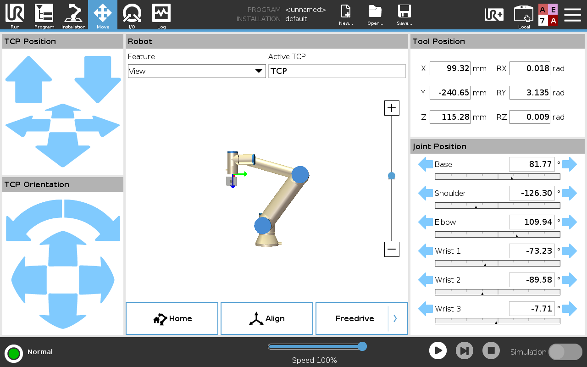
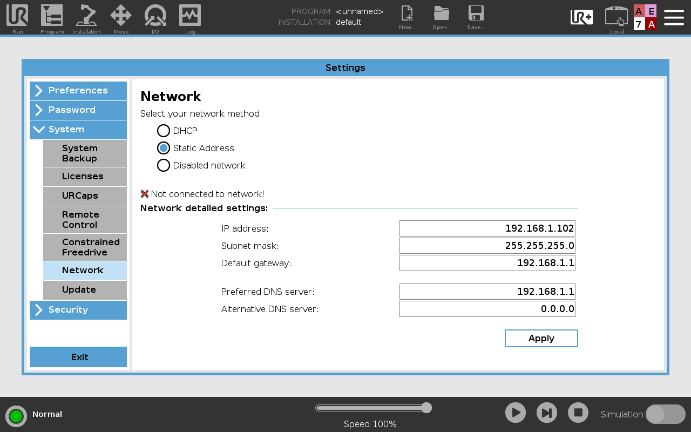
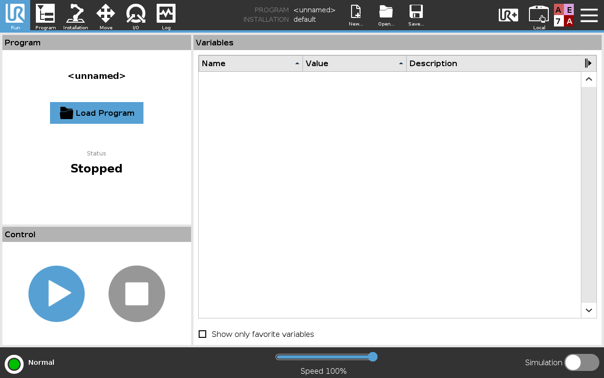
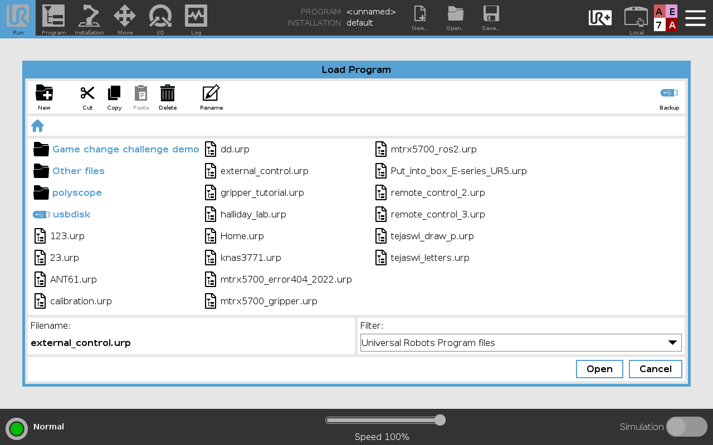
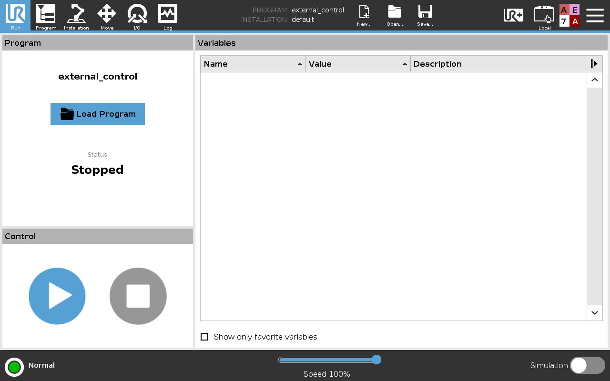
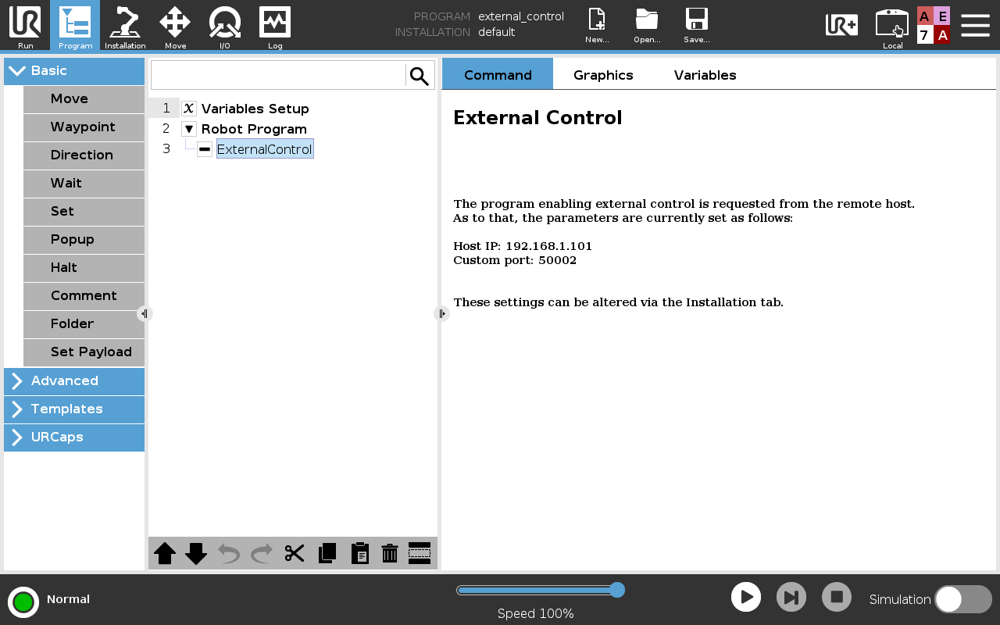
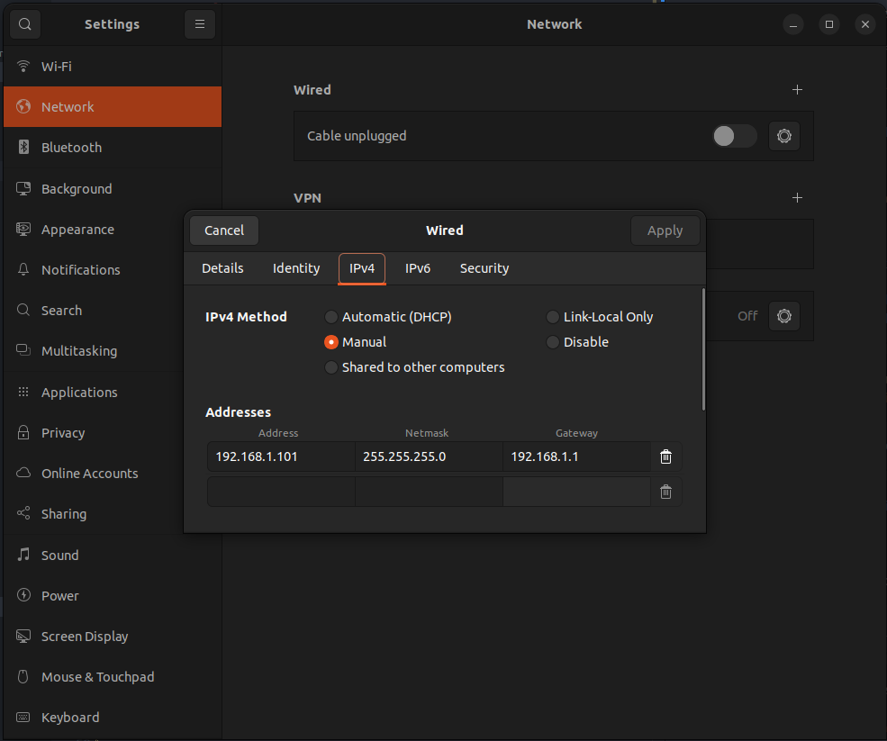
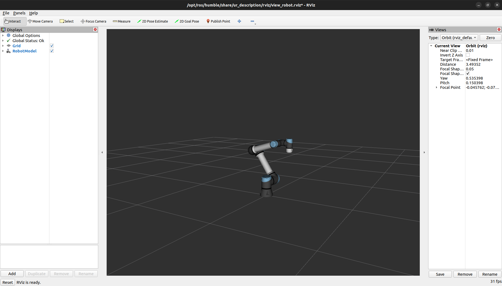
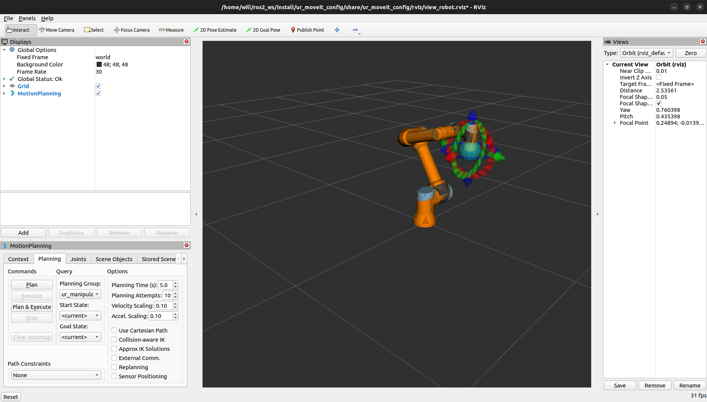

# UR5e_robotiq_ros2_driver
## Introduction
This package is not good. It works... But its not good. Do not use as example. This code acts as a starting point for students in the MTRX Lab at USYD to implement robotic systems on the UR5e with the Robotiq Hand-E gripper using ROS2 (humble). As such this repo can act as a teaching recourse as to the function of the arm and gripper interface. It's also important to note that I wrote this package will doing other assignments, so I'm sure there are some oversights.

## Background
There is one main ROS2 package (thankfully) for the arm which is somewhat well documented and in which i will give more extensive instruction. For the gripper however, there are two open-source drivers available for the Robotiq gripper:
- [AGH-CEAI Robotiq HandE Driver (Humble)](https://github.com/AGH-CEAI/robotiq_hande_driver/tree/humble)
- [PickNik Robotiq Gripper Driver](https://github.com/PickNikRobotics/ros2_robotiq_gripper)

The first repo works well with an extensive visualization, however, the motion planning relies on the URDF and ROS2 control packages. This can interfere with the drivers for the UR5e. Attempts were made to link the URDF for the gripper and arm to make one linked launch, however, unfruitful. The second package errored when I tried to build and I never tried to fix it :).

## About
The design philosophy behind this package design is to merge the control of the gripper and arm into one package. The arm control directly calls the launch files for the UR_drive package whilst the gripper control implements a ROS2 wrapper around another open source package ([pyRobotiqGripper](https://github.com/castetsb/pyRobotiqGripper)). This package works, however, with some minor quirks that are yet to be resolved. 

# Getting Started
## Arm Control
We will start with using ROS2 to control the arm. To set up the tech pendant and external connection, start from the root interface:

Then in the setting set these values:

You can then select the external control program. This releases control from the tech pendant to an external device:

Click `load program`:

Click on `external_control.urp` and `open`

We will run this later once the computer host is set up. You can inspect the program if you click on teh program tab:


This shows that the arm is expecting a host on 192.168.1.102 on the port 50002.

We now need to set up your device to connect. On your device, plug in teh ethernet cable from the arm and open network settings. Click the setting next to the wired connection and add a new config like this:

You can test the connection to ping the robot using:
```bash
ping 192.168.1.102
```


On your device, begin bu installing the UR dependencies:
```bash
sudo apt install ros-humble-ur-client-library
sudo apt-get install ros-humble-ur
```
You can then clone the repo and build:
```bash
cd ~/ros2_ws/src
git clone -b humble git@github.com:UniversalRobots/Universal_Robots_ROS2_Driver.git
cd ~/ros2_ws
colcon build --symlink-install
source install/setup.bash
```

With the arm connected to your device and the network set up, you can test the connection. First launch the driver:
```bash
ros2 launch ur_robot_driver ur_control.launch.py ur_type:=ur5e robot_ip:=192.168.1.102 launch_rviz:=true
```
This should bring up an RVIZ window that looks like:



You can also test the control nodes by running this in a second terminal:
```bash
ros2 launch ur_moveit_config ur_moveit.launch.py ur_type:=ur5e robot_ip:=192.168.1.102 launch_rviz:=true
```
Its important to note that once the driver has been launched, you need to enable the `external control` file on the arm. This will need to be relaunched every time the river is restarted. The control node should bring up a controller that looks like:



To send control commands to the arm you can either do it directly from RVIZ as shown:

And click `Plan and Execute` to move.

Or you can create a client to the move group and send a goal programmatically. For curious nerds, the msg type can be inspected with: 
```bash
cat /opt/ros/humble/share/moveit_msgs/action/MoveGroup.action
```

## Gripper Control
The gripper uses a protocol called `modbus` which is essentially a TCP protocol for USB (with some more steps). This must be enabled to be able to communicate with the gripper. Start by connecting the gripper to your device  with the USB and check the device port using:
```bash
ls /dev/tty*
```
This will show a list of devices with a new one, likely `/dev/ttyUSB0` or similar. This package does scan for teh device, however, its still useful to know. Begin by installing some required packages:
```bash
python -m pip install minimalmodbus
sudo apt install mbpoll
```
You can then enable dialout (essentially allow for serial com through the USB ports):
```bash
sudo usermod -a -G dialout $USER
```
Using the following command essentially pings the gripper. Each ping the light should flash blue before returning to red. This is set up for USB0 so make sure to change that if your device is different:
```bash
mbpoll -m rtu -a 9 -b 115200 -P none -d 8 -s 1 /dev/ttyUSB0
```
If this works, great, I haven't forgotten anything yet. Lets hope it stays that way.

From here we can start the ROS2 interface. Clone this package and build:
```bash
cd ~/ros2_ws/src
git clone git@github.com:C-O-R-N-H/UR5e_robotiq_ros2_driver.git
cd ~/ros2_ws
colcon build --symlink-install
source install/setup.bash
```
You can launch the hand driver using:
```bash
ros2 launch ur_robotiq_driver hand_e.launch.py
```
With this active you can test the open and close using:
```bash
ros2 topic pub /gripper_command std_msgs/msg/String "data: 'open'"
```
and
```bash
ros2 topic pub /gripper_command std_msgs/msg/String "data: 'close'"
```

If this works, congrats you are 90% of the way there. For finer control, you can modify/add to this drive to be able to set force or position, all of which are possible using the gripper package.

## Bringing it together
To launch the arm driver and gripper interface at the same time run:
```bash
ros2 launch ur_robotiq_driver ur_robotiq_control.launch.py
```
This launch file runs all three previous launch files with default args that can be declared (robot_ip, ur_type, launch_rviz)